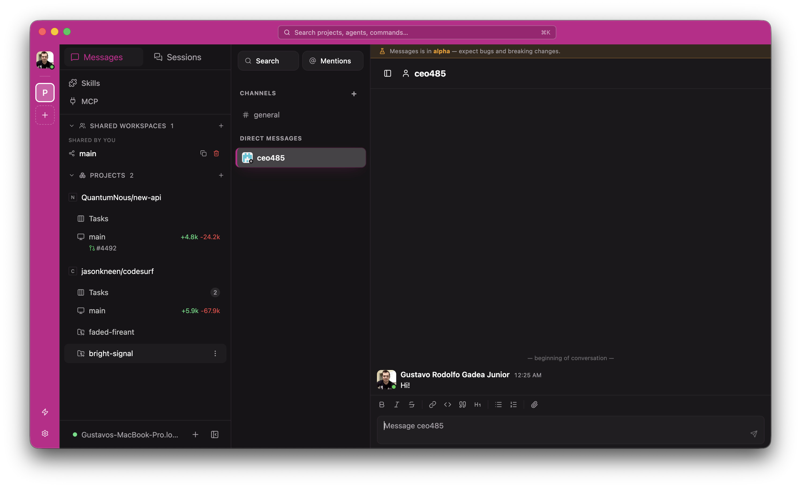
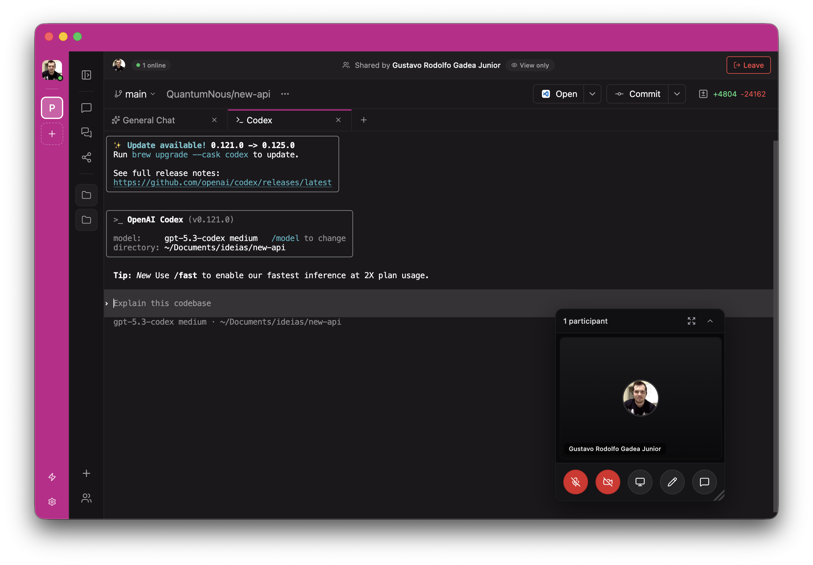
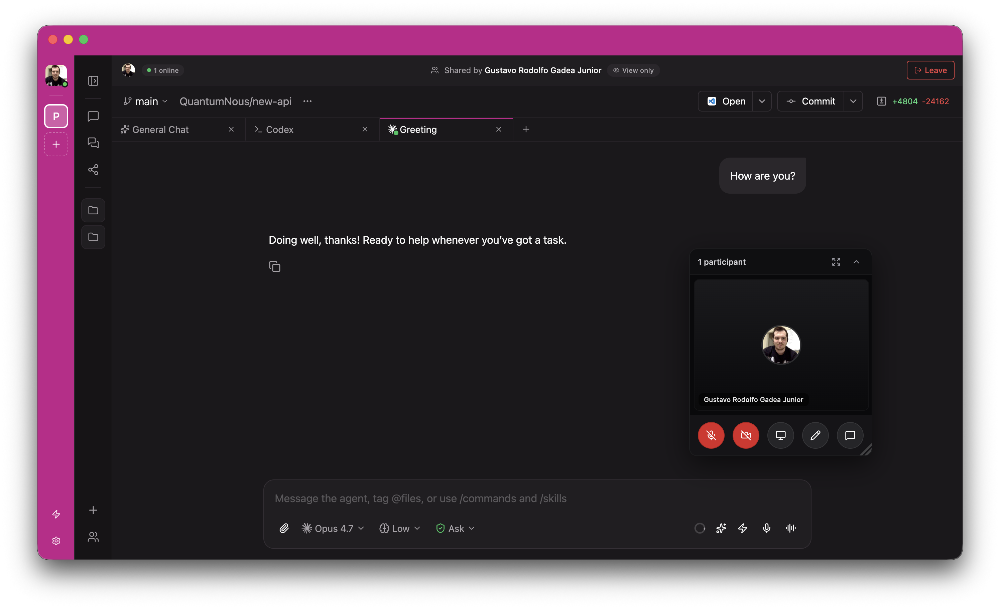

<p align="center">
  
</p>

<h1 align="center">Hubcode</h1>

<p align="center">Self-hosted control plane for your coding agents — chat, kanban, voice, and integrations in one place.</p>

<p align="center">
  
</p>

<p align="center">
  
  
</p>

---

## What is Hubcode?

Hubcode is a single, self-hosted interface that lets you run, monitor and steer your coding agents — Claude Code, Codex, OpenCode, Copilot, Pi, and any installed CLI agent — from your desktop, phone, browser or terminal.

Everything runs on **your** machine: your repos, your credentials, your CI, your shell. The daemon is local; the apps just connect to it.

## Why Hubcode

- **One UI for every agent.** Native GUI providers (Claude Code, Codex, Copilot, OpenCode, Pi) and CLI agents (Codex CLI, Claude CLI, etc.) live side by side. Pick the right tool per task.
- **Kanban for your worktrees.** Each git worktree is a card on a To-do / In-progress / Ready-for-review board. Track parallel agent work like you'd track tickets.
- **Issue tracker integrations.** Link tasks to issues from GitHub, Linear, Jira, GitLab, Forgejo, Plain or Sentry. The agent gets the full issue context as part of its prompt.
- **Voice mode.** Dictate prompts or have a hands-free realtime conversation with your agent — local STT/TTS via Sherpa, no cloud round-trip required.
- **Live shared sessions.** Co-edit and watch agent runs in real time with another teammate; built-in voice/video room while you pair.
- **Cross-device.** iOS, Android, web, Electron desktop, and a `hubcode` CLI. Start a task at your desk, check progress from the bus stop, ship from the terminal.
- **Privacy-first.** No telemetry, no forced sign-in, no cloud requirement. Optional E2E-encrypted relay if you want remote access without exposing the daemon.

## Feature highlights

| Feature | What it does |
|---|---|
| **Multi-agent picker** | Switch between GUI providers (Claude Code, Codex, Copilot, OpenCode, Pi, Hubcode-routed) and installed CLI agents from a single dropdown in the composer. |
| **Per-project kanban** | Tasks tab on every project. New worktrees auto-appear in **To-do**; drag across columns; counts visible in the sidebar. |
| **Composer attachments** | "+" menu in the chat composer attaches images, GitHub issues/PRs, and any connected integration's items as structured context. |
| **New-workspace flow** | Pick agent (GUI or CLI), edit branch name, attach an issue, write the prompt — workspace is created with all metadata wired into the kanban card. |
| **Linked issue context** | Selecting a Linear / Jira / GitHub issue persists `issueContext` and `issueMetadata` on the workspace so the agent and kanban both know what's being worked on. |
| **Hubcode-routed agent** | Optional curated multi-model routing through the Hubcode backend (Pro/Enterprise). Free users see the entry with an upgrade CTA. |
| **Voice (dictation + realtime)** | Hold-to-talk dictation or full realtime conversation; Silero VAD turn detection; runs entirely on the daemon. |
| **MCP server hub** | Configure MCP servers per-project and per-host; agents pick them up automatically. |
| **Loops & schedules** | Run a goal until acceptance criteria pass (`hubcode loop`) or on a cron (`hubcode schedule`). |

## Getting Started

Hubcode runs a local daemon that manages your coding agents. Clients (desktop, mobile, web, CLI) connect to it.

### Prerequisites

At least one agent CLI installed and signed in:

- [Claude Code](https://docs.anthropic.com/en/docs/claude-code)
- [Codex](https://github.com/openai/codex)
- [OpenCode](https://github.com/anomalyco/opencode)

### Desktop app (recommended — macOS)

Download from [hubcode.ai/download](https://hubcode.ai/download) or the [GitHub releases page](https://github.com/hubtool/hubcode/releases). Open the app and the daemon starts automatically — nothing else to install.

> Windows and Linux desktop builds are coming soon. For those platforms, use the CLI below.

To connect a phone or another machine, scan the QR code shown in Settings → Pair Device.

### CLI / headless

Install the CLI and start the daemon:

```bash
npm install -g @hubcode/cli
hubcode
```

A QR code is printed in the terminal — scan it from any client. Useful for servers, remote workstations, or anything without a desktop.

Full setup:
- [Docs](https://hubcode.ai/docs)
- [Configuration reference](https://hubcode.ai/docs/configuration)

## CLI

Everything available in the app is also scriptable.

```bash
hubcode run --provider claude/opus-4.6 "implement user authentication"
hubcode run --provider codex/gpt-5.4 --worktree feature-x "implement feature X"

hubcode ls                           # list running agents
hubcode attach abc123                # stream live output
hubcode send abc123 "also add tests" # follow-up task

# run against a remote daemon
hubcode --host workstation.local:6767 run "run the full test suite"
```

See the [full CLI reference](https://hubcode.ai/docs/cli) for more.

## Orchestration skills (Unstable)

Experimental skills that teach agents how to use the Hubcode CLI to orchestrate other agents. I update these very frequently — expect breaking changes without notice; some are coupled to my own setup. Use at your own risk.

```bash
npx skills add hubtool/hubcode
```

Then use them in any agent conversation:

```bash
# Plan with Claude and hand off to Codex to implement.
/hubcode-handoff hand off the authentication fix to codex 5.4 in a worktree

# Ralph-style loop with clear acceptance criteria.
/hubcode-loop loop a codex agent to fix the backend tests, use sonnet to verify, max 10 iterations

# Spin up a team coordinated through chat.
/hubcode-orchestrator spin up a team to implement the database refactor, use chat to coordinate. use claude to plan and codex to implement and review
```

## Development

Monorepo layout:
- `packages/server` — Hubcode daemon (agent lifecycle, WebSocket API, MCP, voice runtime)
- `packages/app` — Expo client (iOS, Android, web, Electron renderer)
- `packages/cli` — `hubcode` CLI for daemon and agent workflows
- `packages/desktop` — Electron desktop wrapper
- `packages/relay` — E2E-encrypted relay for remote access
- `packages/website` — Marketing site and docs ([hubcode.ai](https://hubcode.ai))

Common commands:

```bash
# run all local dev services in tmux
npm run dev

# run individual surfaces
npm run dev:server
npm run dev:app
npm run dev:desktop

# build the daemon
npm run build:daemon

# repo-wide typecheck
npm run typecheck
```

See [docs/ARCHITECTURE.md](docs/ARCHITECTURE.md) for the full system design and [docs/DEVELOPMENT.md](docs/DEVELOPMENT.md) for the dev loop.

## License

AGPL-3.0
