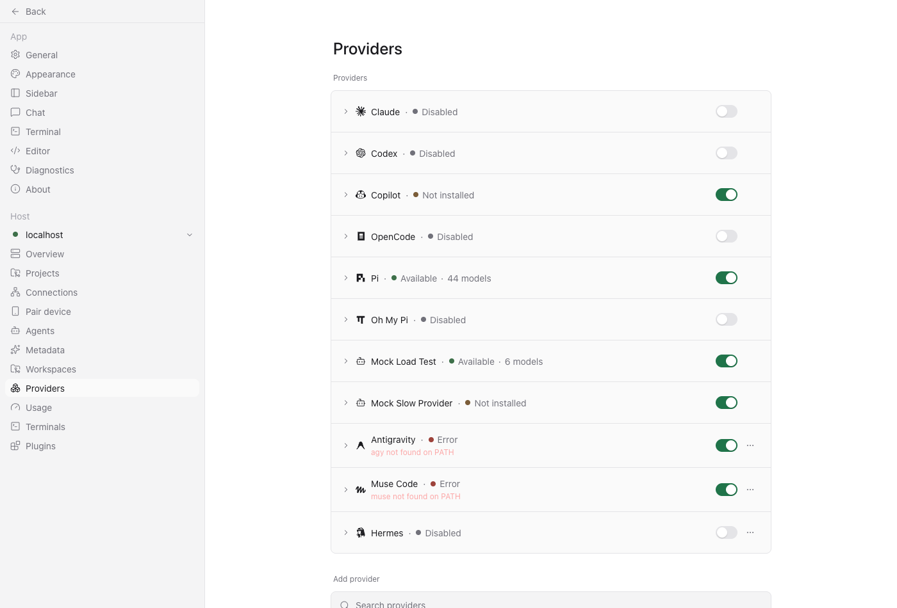
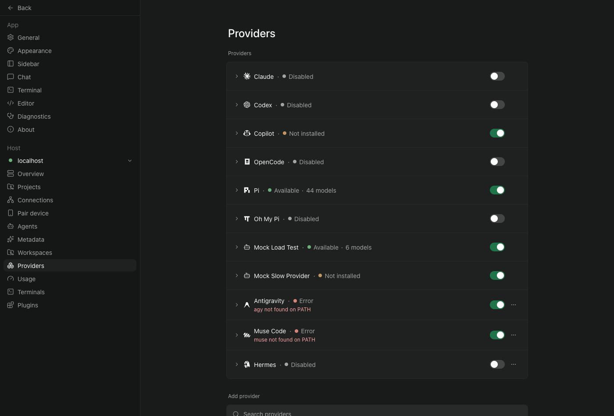

# Hermes provider icon QA

The screenshots show the actual Providers settings route with an isolated daemon and a disabled Hermes ACP provider fixture. No model or Hermes process ran. The UI uses the production icon component. Both themes render the full silhouette in a 16 by 16 slot, matching adjacent provider icon slots.




Validation on macOS, Chrome browser:

```text
npx vitest run src/components/provider-icons.test.ts src/components/provider-icon-name.test.ts
Test Files  2 passed (2)
Tests       12 passed (12)

npx oxlint <five changed TypeScript files>
Found 0 warnings and 0 errors.

npx oxfmt --check <five changed TypeScript files>
All matched files use the correct format.

npm run typecheck --workspace=@getpaseo/app
> tsgo --noEmit
(exit 0)
```

The source SVG path matches the official favicon at the revision in `hermes-icon.LICENSE` after whitespace normalization. The included MIT notice matches that revision's repository license. No separate artwork license was found.

Native iOS, Android and Electron were not tested. The component uses the existing `react-native-svg` renderer. Provider availability shown in the screenshots belongs to the isolated fixture, not to a real Hermes installation.
