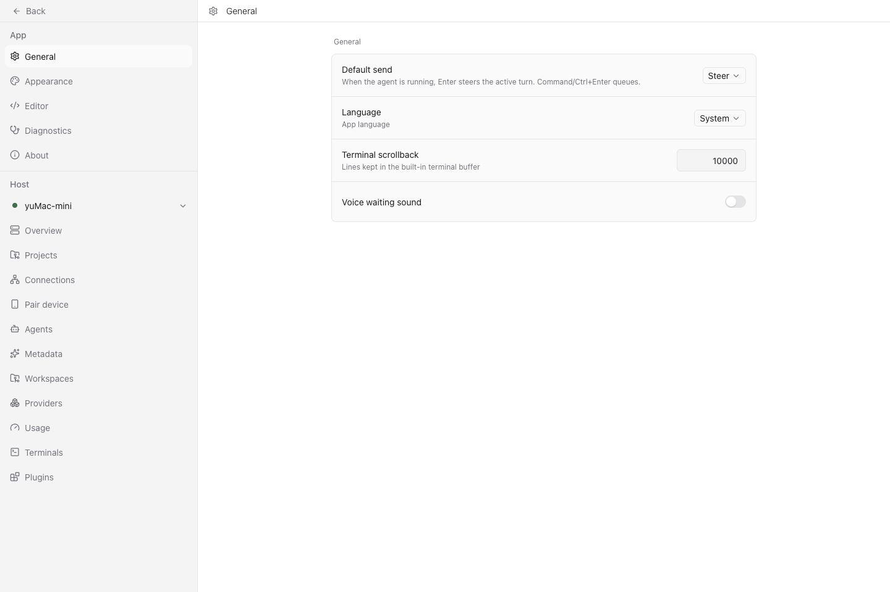
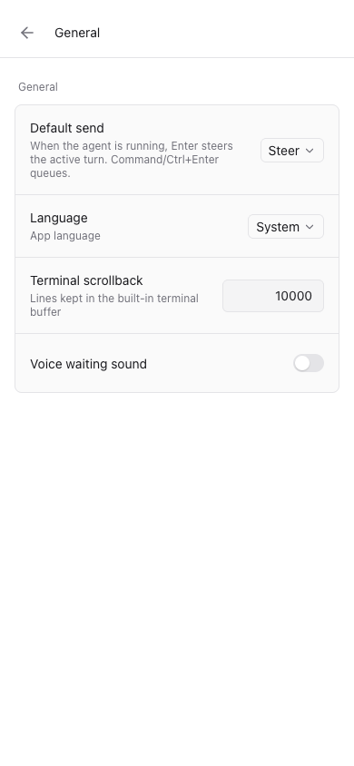

# Local OpenAI-compatible speech endpoints

## Scope

Use the existing OpenAI speech adapter with a local server that accepts OpenAI-shaped
STT and TTS requests. Keep OpenAI defaults and credential precedence for existing
configurations. Configuration examples and the audio contract live in
[the voice guide](../../public-docs/voice.md#unauthenticated-local-endpoints).

The existing plugin API has no speech-provider registration contract. This change
extends the existing configurable endpoint rather than introducing a model-specific
provider, proxy, plugin framework, or settings screen.

`auth: "none"` belongs to each endpoint and requires its own loopback URL. Neither
endpoint credentials nor URLs inherit environment or shared cloud settings in that
mode. Redirects are rejected and local errors are surfaced without selecting another
provider. Authenticated endpoints retain their existing behavior. The SDK requires a
constructor credential; its internal sentinel is removed from outgoing headers and
never appears in user configuration.

TTS model and voice names preserve case. No arbitrary request-parameter map, model
name mapping, language extension, speed option, or streaming toggle is added. MLX
Audio 0.5.6 generated Chinese with the existing request shape. Paseo collects an
entire text segment before playback, so enabling server streaming alone would not
provide incremental playback.

Cancellation must release HTTP resources: STT close aborts pending requests;
TTS receives the caller's abort signal and returns a real Node stream whose destroy
operation cancels the response body. Each committed STT segment owns its audio, so
completion of a cancelled/older request cannot clear a newer recording.
STT clear discards only uncommitted audio: dictation uses it to drop a silence-only
tail while earlier committed segments still need their final transcripts.

## Validation on 2026-09-25

Host: macOS, Apple M4, 32 GiB. Runtime: Node v26.7.0. The repository pins Node
22.20.0; this run does not establish compatibility with every supported Node version.
No installed app, production daemon, personal recording, or paid API was used.

### Automated checks

From `packages/server`, run each changed suite individually:

```sh
npx vitest run src/server/speech/providers/openai/config.test.ts --bail=1
npx vitest run src/server/speech/providers/openai/runtime.test.ts --bail=1
npx vitest run src/server/speech/providers/openai/stt.test.ts --bail=1
npx vitest run src/server/speech/providers/openai/tts.test.ts --bail=1
npx vitest run src/server/agent/tts-manager.test.ts --bail=1
```

The suites exercise configuration precedence, independent endpoints, custom name
case, invalid/missing no-auth URLs, credential conflicts, wire request bodies,
JSON transcription, WAV headers, cancellation, local failures and PCM byte retention.
Provider tests use the real OpenAI SDK with an injected fetch adapter, not module
mocks. The initial no-auth configuration regression failed with `Unrecognized key:
"auth"`. Restoring the previous Web-stream type assertion made the stream destruction
test fail with `ERR_INVALID_ARG_TYPE`; restoring the conversion made it pass.

Root checks: `npm run build:server`, `npm run typecheck`, `npm run lint`, and
`npm run format`. The full test suite is intentionally not run.

### Isolated synthetic HTTP service

A loopback server on an OS-assigned port exercised the real fetch transport,
providers and TTSManager. The run passed:

- STT multipart WAV, custom model, `language=zh`, and `response_format=json`.
- TTS custom model/voice case and absent authentication headers.
- Byte-exact PCM after writes of 1, 3 and 2 bytes; TTSManager combines the whole
  segment before playback, so a network read need not end on a sample boundary.
- HTTP 503 propagated with one request; HTTP 307 rejected without requesting its
  destination; connection refusal propagated without an alternate endpoint.
- Cancellation before response headers closed the server-side response and emitted
  no audio message.

This is a simulated-service smoke check, not model or application end-to-end QA.

### Real MLX Audio service

The independent service used `mlx-audio==0.5.6`, Python 3.12.13, MLX 0.32.2,
Transformers 5.17.0, and an offline model cache. Revisions:

| Model                                                | Revision                                   |
| ---------------------------------------------------- | ------------------------------------------ |
| `mlx-community/Qwen3-ASR-0.6B-8bit`                  | `89e96d92ba34aca20b3e29fb10cc284097d1219f` |
| `mlx-community/Qwen3-TTS-12Hz-0.6B-CustomVoice-8bit` | `049ef77fe8816b536193c0c25f9a214d17921282` |

The service was already running. `curl --fail --max-time 5
http://127.0.0.1:18080/openapi.json` succeeded; `lsof -nP -iTCP:18080 -sTCP:LISTEN`
confirmed a Python listener bound only to `127.0.0.1:18080`. No restart was performed.

The harness parsed persisted configuration through `resolveSpeechConfig`, created
the modified OpenAISTT/OpenAITTS providers, and sent synthesized speech through
TTSManager. It supplied dummy shared cloud settings and asserted that every speech
request targeted the configured loopback URL without Authorization or api-key
headers. Playback acknowledgements came from the harness, not an audio device.

| Operation                                                                                                  | Observed result                                                                                         |
| ---------------------------------------------------------------------------------------------------------- | ------------------------------------------------------------------------------------------------------- |
| STT of an existing 10.40 s synthesized WAV                                                                 | 454 ms; returned `你好，这是本地中文语音测试。今天是九月二十五日，下午三点开会，请检查数字一二三四五。` |
| TTS: `你好，这是本地中文语音测试。今天是九月二十五日。`, voice `Vivian`, PCM, no language/stream extension | 3406 ms; 284160 bytes; 5.92 s at 24 kHz mono PCM16LE                                                    |
| STT of that TTS output                                                                                     | 249 ms; returned the exact input sentence                                                               |
| Destroy long TTS response after headers, before consuming audio                                            | Node stream closed in 2.42 ms; next short request returned headers in 39.66 ms and 61440 audio bytes    |

Generated PCM SHA256:
`8e2bd29e040c83fbf21cf137ef7a8d8e088e82a59a18ff06502eac278de07372`.
It had an even byte length, no WAV header, and nonzero PCM16 RMS (3168.12).
The independent service's native WAV/model checks established 24 kHz, mono,
16-bit little-endian output; raw PCM itself does not describe those properties.
All five observed speech requests returned HTTP 200 on the loopback service.

Times are individual observations, not averages or a performance comparison.
Stream closure and subsequent request availability do not measure precise GPU
cancellation latency. Synthetic round-trip transcription does not establish human
speech accuracy.

## Application acceptance and client follow-ups

The isolated macOS trial subsequently ran on Node 22.20.0. Spoken Mandarin was
transcribed into the owner's existing Codex conversation. In a diagnostic turn,
Codex invoked `mcp__paseo__speak`, the local MLX speech endpoint returned HTTP 200,
and the owner's original Chrome page acknowledged playback. The owner explicitly
confirmed hearing the synthesized reply. The earlier synthetic harness alone did
not establish this result; the actual application trial did.

A fresh trial home also needed `daemon.mcp.injectIntoAgents` enabled. Serving the
MCP endpoint is not the same as injecting its tools into an agent. That trial-only
configuration was corrected without changing the core default or global credentials.
An explicit speak-tool prompt was used for the successful diagnostic; reliable tool
selection across arbitrary natural conversations has not been established.

Two separately committed client improvements complete the tested workflow:

- Draft composers do not supply a voice target until an agent exists. The voice
  shortcut cannot send the `new-workspace` placeholder to the UUID-only endpoint.
  Existing-agent start/stop behavior remains covered by regression tests.
- Settings > General exposes **Voice waiting sound**. It defaults to on and is
  stored per client. Turning it off removes only the repeated waiting cue; waiting
  state, capture, spoken replies and playback acknowledgement remain available.
  Changing the preference while a reply plays does not stop that reply.

Client validation used these individual suites from `packages/app`:

```sh
npx vitest run src/composer/input/state.test.ts --bail=1
npx vitest run src/hooks/use-settings/storage.test.ts --bail=1
npx vitest run src/voice/voice-runtime.test.ts --bail=1
```

Results: 21, 78 and 23 passing tests respectively. Typecheck, lint and formatting
also passed. The original 41 server tests and these 122 client tests were run at
the corresponding implementation steps; this is not a claim of one combined test
run. The full suite was not run.

Real Chromium checks confirmed that the draft-composer shortcut sent no voice
request and exposed no voice button. The settings switch could be turned off and
remained off after reload; desktop and narrow viewport checks reported no page
errors. The owner separately confirmed turning it off in the actual test browser.
The screenshots below show the tested settings state, not native mobile execution.





## Remaining coverage

Native iOS/Android and packaged Electron playback, Windows/Linux daemons, broad
human recognition accuracy, natural multi-turn tool-selection reliability and
long-running stability remain untested. The Node 22 application trial does not
mean every earlier server test was rerun on Node 22. No installed app or primary
daemon was modified, and no private recording is included in the contribution.
