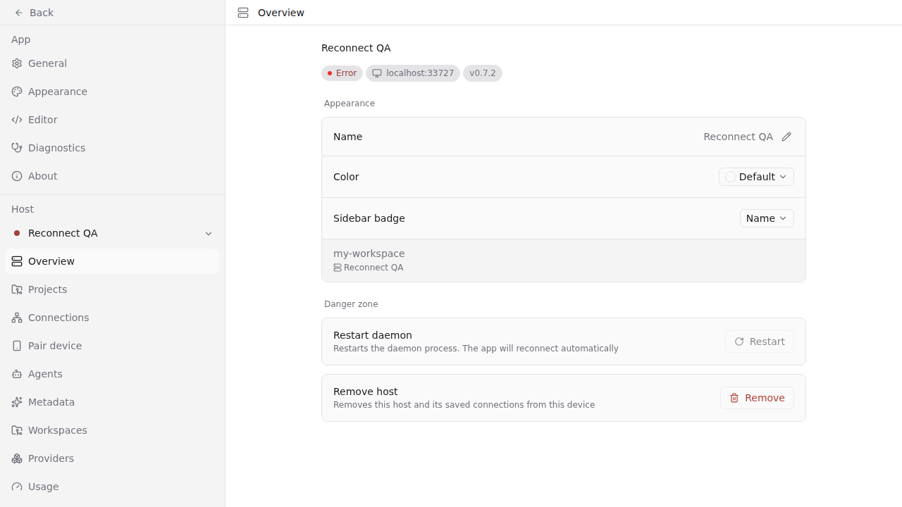
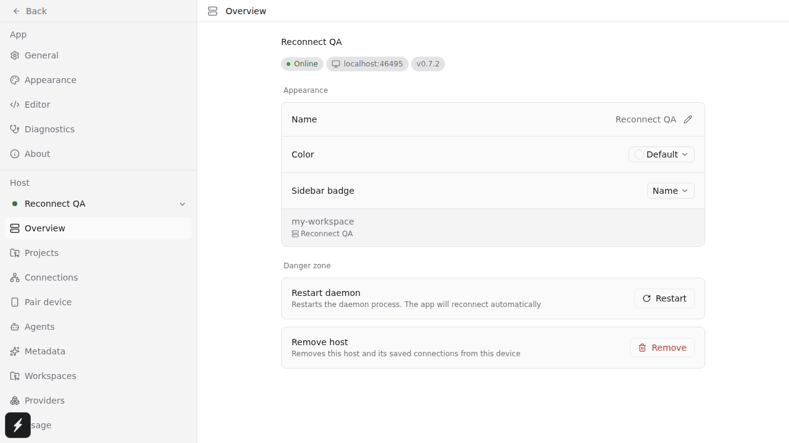
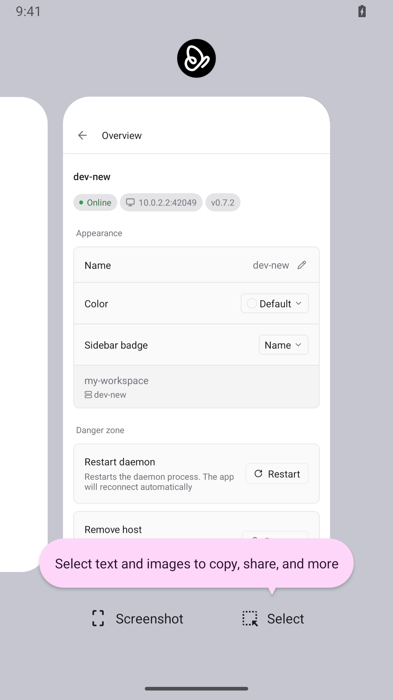
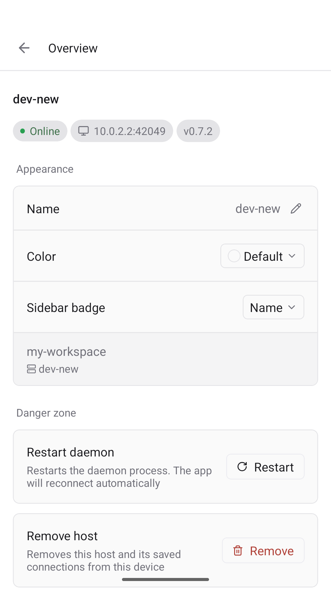
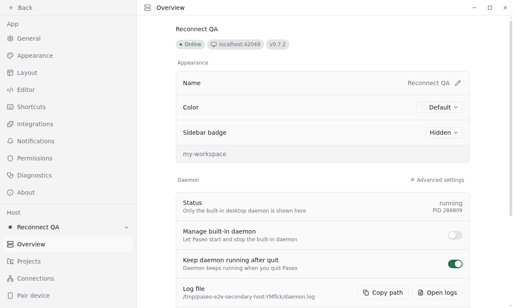

# Background reconnect QA

Verified on 2026-09-07 against the worktree app and isolated development daemon (both report 0.7.2). No wire changes. The baseline was c46aee4e6, including #4160.

## Regression

The lifecycle regression fails before the fix: `inactive` changes the client's reconnect flag to `false`. With the fix, 100 tests pass across the runtime and bootstrap files, covering all three initial states, two hosts, healthy sockets, and immediate foreground reconnect.

```sh
cd packages/app
npx vitest run src/runtime/host-runtime.test.ts src/navigation/host-runtime-bootstrap.test.ts --bail=1
```

[Failing output](unit-red.txt) / [passing output](unit-green.txt).

## Web

The committed Playwright journey starts its own daemon, seeds only that host, dispatches hidden visibility, terminates/restarts its own daemon process tree, waits for a new socket and the Online badge while still hidden, then refocuses.

```sh
npm run test:e2e --workspace=@getpaseo/app -- background-reconnect.spec.ts --project=browser --workers=1
npm run test:e2e --workspace=@getpaseo/app -- background-reconnect.spec.ts --project=browser --workers=1 --repeat-each=2
```

The same journey failed against the baseline: no new WebSocket for 30 seconds after daemon restart. It passed once during development and twice consecutively after restoring the fix. A further run passed after moving setup and cleanup into a test fixture (1 passed, 34.3s). [Baseline output](web-red.txt) / [final output](web-green.txt).

| Before: hidden tab after restart | After: reconnected while hidden |
| -------------------------------- | ------------------------------- |
|           |              |

## Android

Built the dev client from this worktree. The already-running emulator was reserved, so this run used a second existing API 35 x86_64 AVD with fresh app data. The daemon used `startIsolatedHostDaemon` with its own temporary home; the OS assigned daemon port 42049 and Metro port 33799. Restart called the helper's `restart()`, which only terminates its captured child process tree. These port values belong to this run; allocate fresh ports when repeating it.

```sh
# packages/app
CI=1 APP_VARIANT=development npx expo prebuild --platform android --no-install
cd android
./gradlew assembleDebug -PreactNativeArchitectures=x86_64 --no-daemon --max-workers=2 -Dorg.gradle.parallel=false
# BUILD SUCCESSFUL in 2m 44s; 959 actionable tasks: 959 executed

# packages/app, separate shell
CI=1 APP_VARIANT=development REACT_NATIVE_PACKAGER_HOSTNAME=10.0.2.2 \
  EXPO_PUBLIC_LOCAL_DAEMON=10.0.2.2:42049 npx expo start --port 33799 --clear

# repository root
adb -s emulator-5556 install -r packages/app/android/app/build/outputs/apk/debug/app-debug.apk
agent-device --session background-reconnect --platform android --device paseo-api35-2 \
  open sh.paseo.debug 'exp+voice-mobile://expo-development-client/?url=http%3A%2F%2F10.0.2.2%3A33799' \
  --metro-host 10.0.2.2 --metro-port 33799
```

Dismissed the dev menu and first-launch permission prompts. Opened Settings → Overview and verified `Online`, `10.0.2.2:42049`.

```sh
agent-device --session background-reconnect wait text Online 3000
agent-device --session background-reconnect home
agent-device --session background-reconnect appstate
# Foreground app: com.google.android.apps.nexuslauncher
# Restart isolated daemon here, using its owned handle.
agent-device --session background-reconnect open sh.paseo.debug
agent-device --session background-reconnect wait text Online 3000
agent-device --session background-reconnect screenshot android-resumed.png
agent-device --session background-reconnect app-switcher
agent-device --session background-reconnect screenshot android-switcher.png
agent-device --session background-reconnect open sh.paseo.debug
agent-device --session background-reconnect wait text Online 3000
agent-device --session background-reconnect screenshot android-switcher-return.png
```

Observed resume handshake: **471 ms** from Android's resume callback to the daemon accepting the connection. The first post-return assertion passed; there was no persistent disconnected screen. The backgrounded Android process did not complete a reconnect before return in this run. The same socket remained attached across the subsequent app-switcher round trip (no additional `hello`).

Raw event/log excerpts (same machine clock; opaque identifiers omitted):

```text
09-07 20:19:42.413 I wm_on_paused_called: [...,sh.paseo.debug.MainActivity,performPause,3]
RESTARTED 317095 2026-09-07T18:19:56.518Z
09-07 20:20:16.744 I wm_on_resume_called: [...,sh.paseo.debug.MainActivity,RESUME_ACTIVITY,2]
[20:20:17.215] INFO: Client connected via hello
  host=10.0.2.2:42049 userAgent=okhttp/4.12.0 appVersion=0.7.2 resumed=false
09-07 20:20:47.095 I wm_on_paused_called: [...,sh.paseo.debug.MainActivity,performPause,17]
09-07 20:20:47.117 I wm_on_resume_called: [...,sh.paseo.debug.MainActivity,LIFECYCLER_RESUME_ACTIVITY,23]
```

Android's installed React Native `AppStateModule.kt` emits `background`/`active`, not literal `inactive`. The unit regression exercises `inactive`; real iOS interruption behavior remains unverified on this Linux host.

| After daemon restart and return | App switcher              | Returned from switcher           |
| ------------------------------- | ------------------------- | -------------------------------- |
|         |  |  |

## Electron Linux

Built production main with `npm run build:main --workspace=@getpaseo/desktop`. A temporary Playwright `_electron.launch` harness launched `packages/desktop` under `xvfb-run -a`, with separate Electron user data, daemon management disabled, `PASEO_HOME` pointing at the owned isolated daemon, and `EXPO_DEV_URL=http://localhost:33799`.

Used `app.browserWindow(page)` to hide the actual app window, restarted the isolated daemon, then read the host's Online badge before showing the window. Electron 44.2.0 reconnected at 20:18:03.817 after the restart completed at 20:18:01.050. Captured the screenshot after showing the window again.

```text
WINDOW { visible: false, minimized: false, url: '.../settings/hosts/background-reconnect-qa/host' }
STATUS { visibility: 'visible', text: '...Overview\nReconnect QA\nOnline...' }
VISIBLE visible
SCREENSHOT SAVED
```

Under Xvfb, Chromium continued reporting document visibility as `visible` even though the native window was hidden. This verifies actual window hiding and reconnect; the browser test separately proves the hidden document lifecycle. This used the development wrapper and shared Metro renderer, not a packaged release or macOS/Windows window manager.



## Checks and limits

`npm run typecheck`, `npm run lint`, `npm run format`, and `git diff --check` pass. Lint: 0 warnings, 0 errors.

| Platform                | Coverage                                                                                              |
| ----------------------- | ----------------------------------------------------------------------------------------------------- |
| Web                     | Real browser, real restarted daemon, hidden lifecycle, refocus; failing baseline + passing regression |
| Android                 | Built native dev client, API 35 emulator, Home/restart/return, app-switcher round trip                |
| Desktop Linux           | Real Electron dev wrapper under Xvfb, native window hide/restart/show; visibility caveat above        |
| iOS                     | Unavailable on Linux; literal inactive covered by unit tests only                                     |
| Desktop macOS / Windows | Unavailable on this host                                                                              |

This does not verify silent half-open sockets, mobile execution after OS suspension, relay outages, or notification delivery. Healthy sockets and the existing foreground fast path remain unchanged.
