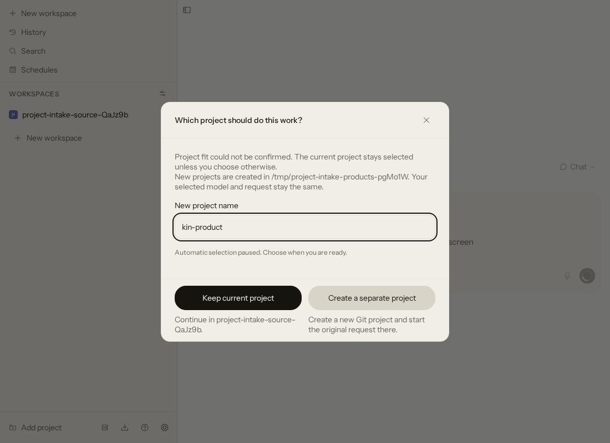
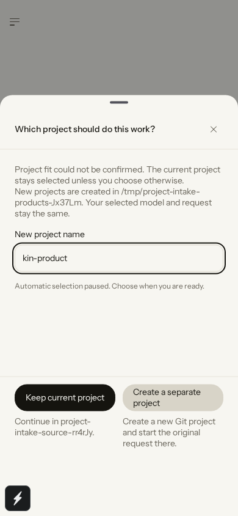

# Project intake

Check that a new request belongs to the selected project before Direct or Kitchen starts.
This optional plugin asks System One / Jev for a recommendation, then lets you keep the project
or create a separate one. A greeting starts without this question.

## Install

Install this directory through PandaOS **Settings → Plugins → Install directory** on the daemon
host. Enable plugins and open **Project intake** in the plugin settings. The host and client
must support submission checks; an older installation reports that it needs an update.
Keep source and new projects on your development host. A remote Mac or Android client sends
requests to that host and does not create a local checkout.

## Decide before starting

The native New workspace composer checks both Direct and Kitchen requests before creating
a workspace or agent. Existing conversations, terminals, empty workspace creation and unattended
daemon dispatch do not use this interactive hook. It never moves an existing session or worktree.

Jev has a total deadline of two seconds. It receives the request, project name and bounded
README/package metadata from that project. It receives no attachments, provider credentials
or model selection. Its explanation is shown in the question.

The default gives you 60 seconds. Focusing the name field, typing or choosing an option stops
the countdown. You can cancel and keep your draft. Without interaction, a sufficiently confident
recommendation can create a separate named project; low confidence, an unavailable Jev or an
unsuitable automatic name keeps the current project. Silence does not authorize a provider change.

The choice preserves your request, attachments, execution mode and explicit model selection.
A separate project gets a folder beside the current project's root, or inside the configured
parent directory. You can edit its name. It gets its own Git history and a short README; the
plugin does not create a GitHub repository or push anything. It refuses an existing directory.

## Settings

| Setting                           | Behavior                                                                                                           |
| --------------------------------- | ------------------------------------------------------------------------------------------------------------------ |
| Check the project before starting | Enable or disable the interactive check.                                                                           |
| Use System One / Jev              | Use the host's existing System One configuration and enabled paths. Disable to make the choice without an AI call. |
| If I leave the question untouched | Follow a confident recommendation, keep the current project, or wait indefinitely.                                 |
| Wait time in seconds              | 5–3600 seconds; default 60.                                                                                        |
| Parent directory for new projects | Existing absolute directory on the daemon host. Empty means beside the selected project's root.                    |
| Daemon home for System One        | Optional host path override. Empty uses the host environment, then `~/.pandaos`. Credentials stay on the daemon.   |

The plugin uses the configured System One model only. It never switches to a paid fallback when
that model is unavailable. System One remains subject to its own host disablement and exclusions.

The host provides an isolated `dataDirectory` for saved decisions. Retries reuse the same
submission identity and target, including after a plugin reload. Removing the plugin removes
its saved decisions. This does not remove projects it created.

## Verification

Focused suites use temporary folders, fake SDK calls and fake HTTP responses. They cover
timeouts, confidence, excluded paths, greetings, cancellation prerequisites, name validation,
idempotent project creation and independent Git history. They make no real model requests.

The host submission-check tests cover preserving the draft and selected configuration, waiting
after interaction, cancellation before mutation, and Direct/Team target routing. Actual UI
evidence is recorded in [the capture record](docs/screenshots/captures.json). These screenshots
use an isolated mock provider with System One disabled; they do not restrict production models.

Project creation and plugin persistence are separate operations. A crash between them can leave
an empty registered project. A retry refuses that existing path rather than adopting unrelated work.
